# Mirai Web CAD


建設・土木の図面を、Webブラウザで作成・修正・確認するための**試作版2D CAD**です。専用ソフトのインストールは不要です。

| 現在の状態 | 内容 |
| --- | --- |
| 🟢 稼働 | MVPサイトとローカルPostgreSQLは稼働中 |
| 🔒 利用者 | `kensan1969@gmail.com`のみ |
| 💾 保存先 | この開発PC内の専用DB `mirai_web_cad_mvp` |
| 🧪 用途 | 操作確認・機能評価用。正式成果品には未使用 |

## 🚀 まず使う方へ

1. [MVP版を開く](https://mirai-web-cad-mvp.mirai-dx-platform.com/)
2. 「Cloudflare」を選び、`kensan1969@gmail.com`のCloudflareアカウントでログインする
3. ログイン後、Mirai Web CADの画面が表示されたことを確認する
4. 画面左の作図ボタン、または画面下のコマンド欄から操作する

このMVP版は**上記メールアドレスだけ**が利用できます。図面データはCloudflare上ではなく、この開発PC内の専用PostgreSQLデータベース`mirai_web_cad_mvp`に保存されます。PCの電源停止やネットワーク障害中は利用できません。

## 🗺️ データの流れ

```mermaid
flowchart LR
    U["👤 CAD利用者<br/>kensan1969@gmail.com"]
    A["🛡️ Cloudflare Access<br/>本人確認・アクセス制限"]
    T["☁️ Cloudflare Tunnel<br/>安全なHTTPS経路"]
    C["📐 Mirai Web CAD MVP<br/>この開発PCで動作"]
    D[("🗄️ ローカルPostgreSQL<br/>mirai_web_cad_mvp")]

    U -->|ログイン| A
    A -->|許可された利用者のみ| T
    T -->|127.0.0.1:18813| C
    C -->|図面を保存・読込み| D

    classDef user fill:#E0F2FE,stroke:#0284C7,color:#0C4A6E,stroke-width:2px;
    classDef security fill:#FFEDD5,stroke:#F97316,color:#7C2D12,stroke-width:2px;
    classDef app fill:#DCFCE7,stroke:#16A34A,color:#14532D,stroke-width:2px;
    classDef data fill:#EDE9FE,stroke:#7C3AED,color:#4C1D95,stroke-width:2px;
    class U user;
    class A,T security;
    class C app;
    class D data;
```



> [!NOTE]
> Cloudflareはログイン確認と通信経路を担当します。図面そのものはCloudflareへ保存せず、この開発PC内のPostgreSQLへ保存します。

## 🧰 できること

- ✏️ **基本作図**: 線、円、円弧、楕円、スプライン、矩形、ポリライン、文字、寸法、ハッチ
- 📏 **正確な編集**: 移動、複写、回転、鏡像、配列、切断、結合、トリム、延長、オフセット
- 🧩 **形状編集**: 面取り、フィレット、閉じた境界の作成、ポリライン頂点の編集
- 🎨 **レイヤー**: 作成、表示、ロック、色・線幅の変更
- 📥 **データ交換**: DXFとMirai JSONの読込み、限定的なDXF書出し
- 🗂️ **図面管理**: 保存、レビュー、承認、操作履歴の記録
- 🤖 **AI提案**: AIの変更案を、人が確認してから図面へ反映

## ⚠️ まだ業務の正式成果品には使わないでください

> [!WARNING]
> これはMVP（実用性を確かめる試作版）です。DWG、SXF、電子納品、尺度保証付きPDF、道路縦横断、測量座標、BIM/CIMなどは未完成です。重要な図面は、必ず既存CADと原本ファイルにも残してください。

以下は、開発者・評価担当者向けの詳しい実装状況です。**試作**は動作確認用、**限定対応**は主なケースのみ対応、**実案件認定済み**は実案件による受入試験済み、という意味です。現在、実案件認定済みの機能はありません。

GitHub正本は`mirai-construction-dx/Mirai-Web-CAD`です。2026-08-26に`Construction-Enterprise-OS/Mirai-Web-CAD`から履歴を保持して`Kensan196948G/Mirai-Web-CAD`へ移行し、2026-09-24にGitHub組織`mirai-construction-dx`へTransferしました。

| 領域 | 段階 | 内容 |
| --- | --- | --- |
| 図面作成 | 限定対応 | 空図面/デモ図面の新規作成、図面名、単位（mm/m）。案件・工区管理なし |
| 作図 | 限定対応 | 基本図形、パン・ズーム、移動、複写、回転、尺度、Undo/Redoは動作。**精密編集(2026-09-04〜05追加)**: MIRROR/ARRAY/BREAK/JOIN、境界交点TRIM・EXTEND、真の平行OFFSET、CHAMFER、BOUNDARY、PEDITを利用可能。**円弧・楕円・スプライン**はリボンまたは`ARC`/`ELLIPSE`/`SPLINE`コマンドで作図でき、ネイティブ図形のままJSON/DXF往復、選択、OSnap、移動・回転・尺度・鏡像に対応。STRETCH(点列/制御点)、EXPLODE(RECT/PLINE/属性なしBLOCK)、MATCHPROP(layer/style)、単一図形の点・曲線グリップを追加。全形式対応とMulti-gripは後続。詳細は[追加実装ロードマップ](docs/additional-implementation-roadmap.md) |
| UI | 限定対応 | リボン、モデル/レイアウト空間タブ、タブ式右ドック、ステータスバーは動作。作図Canvasは表示寸法×devicePixelRatioで描画し、円の縦横比・ポインター座標・高DPI画面での鮮明さを保つ。`ZOOM EXTENTS`/図面範囲表示は実寸Canvasへ60,000mm級の図面も余白50px以上で中央に収め、ズーム・パン・全体表示で変えた表示位置は図面ごとにブラウザへ記憶し(最大30図面、サーバーには保存しない)、再読込時に復元する。記憶がない、または記憶位置が図面から外れた場合は、起動時に既定表示へ収まらない図面だけを自動でZOOM EXTENTSする。縮小表示では格子を10倍ずつ粗くし(スナップ間隔は不変)、1%未満の縮尺も有効桁で表示する(2026-09-25、Issue #78)。モバイル(幅980px以下)ではコマンドラインをCanvas直下に置いて覆わないようにし、ステータスバーは折り返さず横スクロールする(2026-09-25)。ただし編集用途では未成熟(閲覧・朱書き用途を推奨) |
| 作図補助 | 限定対応 | グリッド表示・スナップ、直交モードは動作。**OSnap(2026-09-04拡張)**: 端点・中点・中心・四分点・交点を既定とし、垂線・近接点は設定ダイアログの「OSnap対象」から追加ON可能。OSnapが吸着した点は直交モードより優先する(AutoCADと同じ。吸着しなかった点だけ直交拘束)。接線・極トラッキング・追跡線は未対応 |
| コマンドライン | 限定対応 | 座標は絶対`x,y`・極`距離<角度`に加え、2点目以降で相対`@dx,dy`・相対極`@距離<角度`を指定可能(2026-09-25)。表示は`ZOOM E`(全体)、`ZOOM W [x1,y1 x2,y2]`(窓。点を省略するとCanvasで2回クリック)、`ZOOM 2X`/`ZOOM 0.5X`(画面中心を保った倍率)、`ZOOM P`(前の表示へ。最大20件、ホイールの連続操作は1件にまとめる)に対応し、リボンの表示タブにも窓ズーム・前画面を追加(2026-09-25)。基本作図・精密編集に加え、線分の連想Aligned/水平/垂直、円/円弧の半径/直径寸法、書式Overrideを利用可能。詳細は[連想寸法](docs/associative-dimensions.md)。角度/公差/連続寸法/名前付きStyleは後続。`HATCH`は島・境界探索・連想更新なし。`BLOCK`はchildrenを持つ簡易構造で、属性なしBlockのEXPLODEは対応、定義/参照分離・属性定義・再定義・ライブラリは後続 |
| Import | 限定対応 | Mirai JSON、ASCII DXFのLINE/CIRCLE/ARC/**ELLIPSE/SPLINE**/LWPOLYLINE/POLYLINE/TEXT/MTEXTを読込。円弧・楕円・スプラインはネイティブ図形としてDXF往復対応。DXF書出しはline/circle/arc/ellipse/spline/polyline/rect/text+Layersに対応。dimension/hatch/blockは「黙って捨てず」スキップ理由付きで報告。DWGは対象外です([ADR-0002](docs/adr/ADR-0002-dwg-scope-drop-dxf-only.md)) |
| レイヤー | 限定対応 | 作成、名称・色編集、表示、ロック、現在レイヤー指定、図形のレイヤー変更は動作 |
| プロパティ | 限定対応 | 単一図形の種類・ID確認、レイヤー・線幅編集に対応。Window/Crossing/複数選択、Shift追加・除外、全選択、選択セットの移動・削除・数値変形に対応。Fence/Lasso、Previous/Last、類似・条件選択、名前付き選択セット保存を追加。LENGTHEN/REVERSE/PURGE/OVERKILLの対象制限は[高度な選択と追加編集](docs/advanced-selection-editing.md)を参照。個別プロパティ編集は1件選択時のみ。曲線選択はsampling近似、選択インデックスは後続 |
| レイアウト | 試作 | A4～A1、縦横、縮尺、余白、表題の設定は可能だが、レイアウト空間は実図形を描画せずビューポートを示す文字表示に留まる。印刷は`window.print()`依存 |
| AI提案 | 限定対応 | Promptから構造化コマンドを生成し、Canvasへプレビュー後、人の承認で適用。ルールベース(3パターン)を優先し、拾えない場合のみサーバー側プロキシ経由でOpenAI/Anthropicへフォールバックする(2026-08-30〜)。有効化状態は`GET /api/ai/status`で確認可能(鍵は返さない) |
| 検査 | 限定対応 | 重複ID、存在しないレイヤー、用紙外、0長線、円半径、Critical残存を検出。API未接続時は「検査不能」表示に切り替え、承認操作を無効化する(2026-08-29修正) |
| 版/承認 | 限定対応 | 下書き、レビュー提出、承認、承認済み版の直接変更禁止、新版作成は動作。API接続確認(`state.apiStatus.state === "ok"`)が取れている場合のみ操作を許可し、未接続時はサーバー権限を経由しないローカル完結を行わない(2026-08-29修正) |
| 権限 | 限定対応 | 閲覧者、作図者、レビュアー、承認者、CAD管理者の主要操作制御は動作。ロール切替はAPI接続確認後にサーバー実効権限へロックされる。ロール解決はメール個別指定(`ACCESS_ROLE_MAP`)が最優先、次点でEntra IDグループ所属(`ENTRA_GROUP_ROLE_MAP`、非対話式Graph API、任意設定、2026-08-30〜)を参照する。ログインはCloudflareアカウントを使用する |
| 保存 | 限定対応 | LocalStorage自動保存(平文)、JSON出力、デモ初期化。認証済みAPI接続時はローカルPostgreSQLへ同期(2026-08-30〜、Issue #22で移行完了) |
| API | 限定対応 | `/api/health`、図面取得、Transaction、AI Run、承認、監査ログ、重複実行拒否を実装。本番はローカル常駐サーバー(`scripts/serve-production.mjs`)経由でCloudflare Tunnelから配信 |
| 状態確認 | 限定対応 | 正常、空、Loading、Errorを画面内のState Reviewで切替 |
| システム設定 | 限定対応 | 上部設定からグリッド表示、スナップ、間隔、コマンドログ行数をブラウザ単位で保存 |
| DB | 限定対応 | ローカルPostgreSQL 16(このホスト常駐)へ接続し、図面、AI Run、監査、Idempotencyを永続化。2026-08-30にNeon PostgreSQLから移行完了(Issue #22) |

## 🌐 利用URL

| 用途 | URL | 状態 |
| --- | --- | --- |
| MVP（今回の確認用） | `https://mirai-web-cad-mvp.mirai-dx-platform.com/` | Cloudflare Accessでサイト全体を保護。`kensan1969@gmail.com`だけログイン可能。データはローカルPostgreSQLの専用DB`mirai_web_cad_mvp`へ保存 |
| Custom Domain(本番) | `https://mirai-web-cad.mirai-dx-platform.com/` | Cloudflare Tunnel経由でローカル常駐サーバーへ配信。SPAと公開デモは匿名閲覧可。任意図面と全更新APIはCloudflare Accessで保護。未認証アクセスはエッジ層で302(Accessログインへのリダイレクト)、アプリ層に到達した場合は401 |
| Cloudflare Pages(参考、ロールバック用) | `https://mirai-web-cad.pages.dev/` | mainマージでは更新されない。SPAのみ200、`/api`は移行前のコードのままで機能しない |

Cloudflare設定は[Terraform運用手順](infra/cloudflare/README.md)でコード管理します。既存資源をimportして差分を確認するまで、Terraformの管理スイッチは無効です。障害時は[Runbook](docs/runbooks/service-outage.md)を参照してください。

## 🛠️ 開発者向けの起動方法

```bash
npm run dev
```

起動時に端末へ自動割当された有効なLAN IPv4アドレスを検出し、次の形式でアクセス先を表示します。IPアドレスがDHCP等で変わった場合も、次回起動時に再検出されます。

```text
Local: http://127.0.0.1:4174/
Network (eno1): http://192.168.x.x:4174/
```

同一LAN上の端末からは`Network` URLを開きます。LANへ公開しない場合は`HOST=127.0.0.1 npm run dev`でループバックだけに制限できます。開発サーバーはSPAと`/api`を同一オリジンで提供します(既定はメモリストア)。

本番相当のサーバー(`scripts/serve-production.mjs`)の詳細は[ローカルデプロイ運用メモ](docs/deployment-local.md)を参照してください。

## ✅ 検証

```bash
npm run verify
```

実行内容:

- `npm run lint`: 必須ファイル存在、JS構文、未解決マーカー、`_headers`の書式を検査
- `npm run lint:static`: ESLintで未定義参照・重複キー・到達不能コード・未使用変数等、実行時バグに直結する規則を検査(整形規則は入れず、`require-atomic-updates`は変数の再代入のみ警告。現在の警告0件)
- `npm run typecheck`: TypeScriptの`checkJs`でブラウザ/Core/API/DB層を型検査
- `npm run a11y`: lang、viewport、aria、focus-visible、Responsive CSS等を静的検査
- `npm test`: CAD Core、コマンド解析、JSON/DXF Import、公開境界、API認証/権限、JWT fail-closed、Idempotency、原子更新、AI承認を検査
- `npm run build`: `dist/`へ静的配信物を生成
- `npm run test:e2e`: desktop/mobile Chromiumで新規作成、コマンドライン、Undo/Redo、Import、API同期、AI承認、Keyboard、axeを検査

## 🗄️ DB初期化

空のPostgreSQL(ローカルまたは検証用)へ適用する場合:

```bash
DATABASE_URL="postgresql://..." npm run db:verify
```

`db:verify`は`0001_initial.sql`から`0008_audit_truncate_guard.sql`と`seeds/demo.sql`を2回適用し、9テーブル、公開デモ属性、Seed重複なし、監査ログの追記専用トリガー**3件**(UPDATE/DELETE/TRUNCATEを拒否)、JSONBの二重保存がないことを検証します。ローカルPostgreSQL 16での適用を確認済みです。読み取り専用で状態だけを確認したい場合は`npm run db:check`を使います(`db:verify`と異なりDBを変更しません)。デプロイ手順(`scripts/deploy-local.sh`)は本番DBへ書き込まない`db:check`を実行します(2026-09-25〜、改善台帳P0-74)。migrationを含むリリースは[ローカルデプロイ運用メモ](docs/deployment-local.md)の手順で事前に適用します。

バックアップ/復元ドリル:

```bash
DATABASE_URL="postgresql://..." BACKUP_FILE="artifacts/cad.dump" npm run db:backup
RESTORE_DATABASE_URL="postgresql://...empty-db" BACKUP_FILE="artifacts/cad.dump" ALLOW_DATABASE_RESTORE=yes npm run db:restore
```

## 🔎 主要な受入観点

- CAD CoreがAIから独立し、AIは図面を直接変更しない
- AI変更は追加/削除の影響をプレビューし、人が承認して初めてTransaction化する
- 閲覧者と承認者は作図できず、作図者は承認できない
- レイヤーロックと承認済み版はfail-closedで変更拒否する
- Critical検査項目が残る図面は承認不可
- API更新は`Idempotency-Key`と`expected-version`がない場合に拒否する
- 同じ`Idempotency-Key`の再送は409で拒否し、二重変更を防ぐ
- 本番の`AUTH_MODE=access`ではAccess JWTの署名、issuer、audienceを検証し、ロールはサーバー設定から決定する
- Custom DomainのSPA、health、`visibility=public`のデモ図面は一般公開し、任意図面取得と全更新はfail-closedで拒否する(2026-08-30〜Cloudflare Accessが`/api/*`書込み系を保護。未ログインブラウザ・未認証クライアントはAccessログインへの302、アプリ側の直接fail-closed判定は401)
- 図面、版、最新command event、監査、Idempotency、AI承認状態を単一DB文で確定する
- `main`へのmerge後、`.github/workflows/production.yml`が全検証を実行する(実配信は`scripts/deploy-local.sh`の手動実行、[運用・復旧メモ](docs/operations.md)参照)

## 📐 CAD互換範囲

現段階はAutoCAD/Ares Standardの完全互換ではありません。土木施工図向け2D作図、主要幾何編集、寸法、ハッチ、ブロック、レイヤー、レイアウト/PDF印刷(`window.print()`ベース、ベクタ・尺度保証PDFは未実装)を実装しています。**DXF書出しは限定対応です**(2026-09-04〜05、line/circle/arc/ellipse/spline/polyline/rect/text+Layers。ASCII DXF R2000系。真色420・線種・レイヤ表示/ロックフラグ・dimension/hatch/blockは後続Phase)。**DWGは恒久的に対象外です**([ADR-0002](docs/adr/ADR-0002-dwg-scope-drop-dxf-only.md))。外部参照(XREF)は現Phaseでは未実装です(80-90%代替方針§2.2の90%追加要件、Phase 2で再評価予定)。3D、業界固有アドオンは恒久的に対象外です。対象/限定対応/対象外の詳細な線引きと再校正手順は[代替範囲・採点基準](docs/compat-scope-and-scoring.md)を参照してください。

## 📚 関連文書

- [Roundログ](docs/mvp-round-log.md)
- [外部入力・確定待ち台帳](docs/external-input-status.md)
- [機能カタログ×実装状況マトリクス](docs/feature-catalog-coverage.md)
- [運用・復旧メモ](docs/operations.md)
- [ローカルデプロイ運用メモ](docs/deployment-local.md)
- [API/DBメモ](docs/api-db.md)
- [テスト方針](docs/testing.md)
- [要件・設計トレーサビリティ](docs/mvp-traceability.md)
- [本番運用適合性評価書](docs/production-readiness-assessment.md)
- [改善台帳](docs/improvement-register.md)
- [独立リポジトリ移行Manifest](docs/migration-manifest.md)
